<!DOCTYPE html>
<html lang="en">

<head>
    <!-- META -->
    <meta charset="utf-8">
    <meta http-equiv="X-UA-Compatible" content="IE=edge">
    <meta name="viewport" content="width=device-width, initial-scale=1">

    <!-- PAGE TITLE -->
    <title>
        RUIZ & BETANCOURT CONSTRUCTORES S.A. DE C.V.
    </title>

    <!-- BOOTSTRAP CSS -->
    <link rel="stylesheet" href="css/bootstrap.min.css">

    <!-- ALL GOOGLE FONTS -->
    <link href="https://fonts.googleapis.com/css?family=Raleway:400,500,600,700" rel="stylesheet">

    <!-- FONT AWESOME CSS -->
    <link rel="stylesheet" href="css/font-awesome.min.css">
    <link rel="stylesheet" type="text/css" href="css/pe-icon-7-stroke.css">

    <!-- OWL CAROSEL CSS -->
    <link rel="stylesheet" href="css/owl.carousel.css">
    <link rel="stylesheet" href="css/owl.theme.css">

    <!-- MAGNIFIC CSS -->
    <link rel="stylesheet" href="css/magnific-popup.css">

    <!-- Circliful CSS -->
    <link rel="stylesheet" href="css/jquery.circliful.css">

    <!-- ANIMATE CSS -->
    <link rel="stylesheet" href="css/animate.min.css">
    <link rel="stylesheet" href="css/effects.css">
    <link rel="stylesheet" href="css/YTPlayer.css">

    <!-- MAIN STYLE CSS -->
    <link rel="stylesheet" href="css/style.css">

    <!-- HTML5 shim and Respond.js IE8 support of HTML5 elements and media queries -->
    <!-- WARNING: Respond.js doesn't work if you view the page via file:// -->
    <!--[if lt IE 9]>
    		  
    		  
        <![endif]-->
    
</head>

<body>

    <!-- START PRELOADER -->
    

        

            

        

    

    <!--  END PRELOADER -->

    <!-- START HOMEPAGE  -->
    <header id="home" class="home-area">
        

            <nav class="navbar navbar-expand-lg navbar-dark bg-dark static-top">
                

                    

                        

                            <!-- START LOGO -->
                            <a href="index.html">
                                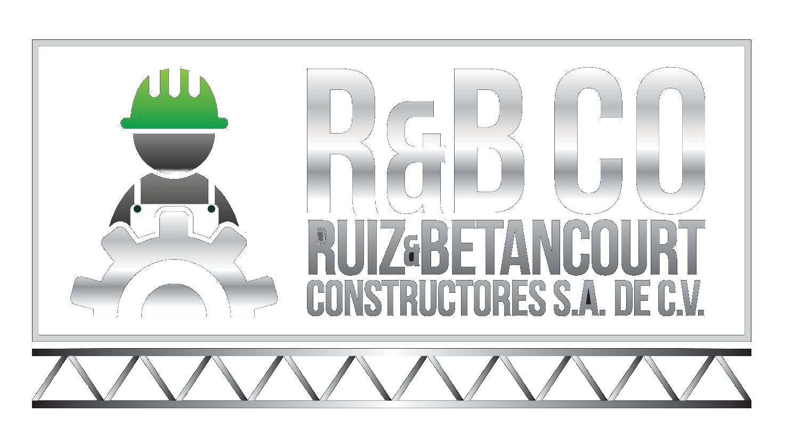
                            </a>
                            <!-- END LOGO -->
                        

                        

                            <!-- START MENU   -->
                            

                                

                                    

                                        <button type="button" class="navbar-toggle" data-toggle="collapse" data-target=".navbar-collapse">
                                            Toggle navigation
                                            
                                            
                                            
                                        </button>
                                    

                                    

                                        <ul class="nav navbar-nav navbar-right">
                                            <li class="active"><a class="smoth-scroll" href="#home">Inicio 

</a>
                                            </li>
                                            <li><a class="smoth-scroll" href="#about">Historia</a>
                                            </li>
                                            <li><a class="smoth-scroll" href="#skills">Normativas</a>
                                            </li>
                                            <li><a class="smoth-scroll" href="#resume">Instituciones</a>
                                            </li>
                                            <li><a class="smoth-scroll" href="#service">Servicios</a>
                                            </li>
                                            <li><a class="smoth-scroll" href="#work">Proyectos</a>
                                            </li>
                                            <li><a class="smoth-scroll" href="#blog">Clientes</a>
                                            </li>
                                            <li><a class="smoth-scroll" href="#contact">Contactanos</a>
                                            </li>
                                        </ul>
                                    

                                

                            

                            <!-- END MENU   -->
                        

                    

                    <!--end row-->
                

            </nav>
            <!--end container-->
        

        

            

            

                

                    

                        

                            

                                

                                    <h2 style="color:antiquewhite; font-size: 4vw; ">RUIZ & BETANCOURT CONSTRUCTORES
                                        S.A.
                                        DE C.V.</h2>
                                    
<q>SOLUCIONES INTEGRALES A SUS PROYECTOS.</q> 

                                    

                                        <ul>
                                            <li><a href=""><i class="fa fa-facebook"></i></a></li>
                                            <li><a href=""><i class="fa fa-instagram"></i></a></li>
                                            <li><a href=""><i class="fa fa-google-plus"></i></a></li>
                                            <li><a href=""><i class="fa fa-whatsapp"></i></a></li>
                                        </ul>
                                    

                                    <a class="btn btn-custom smoth-scroll" href="#contact">Contactanos</a>
                                

                            

                        

                        <!--end row-->
                    

                    <!--end container-->
                

            

        

    </header>
    <!--  END HOMEPAGE -->

    <!-- START ABOUT -->
    <section id="about" class="section">
        

            

                

                    

                        <h2 class="text-center">ACERCA DE NOSOTROS</h2>
                        

                    

                

            
<!-- End row -->

            

                

                    

                        <h2 class="title">Nuestra historia</h2>

                        
Somos RUIZ & BETANCOURT CONSTRUCTORES S.A. DE C.V. Una empresa de multi-operaciones,
                            dedicada a la integración de soluciones de ingeniería en las áreas eléctrica, mecánica y
                            obras civiles. Inicia operaciones en la ciudad de San Pedro Sula en el año 2010 como una
                            empresa de soluciones integrales a las necesidades del mercado, destacando desde sus
                            inicios en sistemas electromecánicos, de energía renovables y obras civiles, industriales
                            comerciales y residenciales. Desarrollando proyectos como ser: redes de media y baja
                            tensión, energías renovables, sistemas de ventilación, protección contra descargas
                            atmosféricas y trascientes, medición y calidad de energía para eficiencia energética,
                            sistemas de control y automatización, sistemas de datos (Data Center), sistemas de HVAC,
                            sistemas neumáticos y de vapor, pintura arquitectónica, industrial en estructuras elevadas,
                            obra gris, tabla yeso, estructuras metálicas, sistemas hidrosanitarios, terracería entre
                            otros.
                        

                        

                            
<b>Segmento de mercado</b>

                            <ul>
                                <li style="margin-bottom: 5px;">+ Gestión de proyectos de Energía Renovable.</li>
                                <li style="margin-bottom: 5px;">+ Industria Textil.</li>
                                <li style="margin-bottom: 5px;">+ Hilanderías.</li>
                                <li style="margin-bottom: 5px;">+ Manufactureras.</li>
                                <li style="margin-bottom: 5px;">+ Industria de Fibrocemento.</li>
                                <li style="margin-bottom: 5px;">+ Plantas de Biomasa.</li>
                                <li style="margin-bottom: 5px;">+ Hidroeléctricas.</li>
                                <li style="margin-bottom: 5px;">+ Industria Farmacéutica.</li>
                                <li style="margin-bottom: 5px;">+ Gasolineras y planta de gas.</li>
                                <li style="margin-bottom: 5px;">+ Proyectos residenciales y comerciales.</li>
                                <li style="margin-bottom: 5px;">+ Condominios de apartamentos.</li>
                                <li style="margin-bottom: 5px;">+ Industria alimenticia, bebidas y similares.</li>
                                <li style="margin-bottom: 5px;">+ Industria de concentrado para animales.</li>
                                <li style="margin-bottom: 5px;">+ Banca privada.</li>
                            </ul>
                        

                    

                

                

                    

                        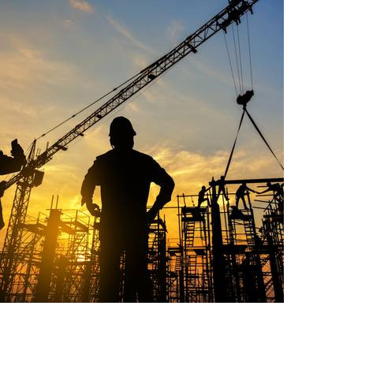
                    

                

            

            <!--end row-->
        

        <!--end container-->
    </section>
    <!--  END ABOUT-->

    <!-- START SKILL -->
    <section id="skills" class="section bg-dark">
        

            <!-- Skills -->
            

                

                    

                        <h3>Mision</h3>
                        

                        

                    

                    

                        
 Ser la empresa líder en ingeniería de la construcción de obras civiles,
                            electromecánicas y energías renovables, altamente reconocida a nivel nacional e
                            internacional por su compromiso, capacidad, calidad, respaldo y cumplimiento de
                            las normas de seguridad.
                        

                    

                

                

                    

                        <h3>Vision</h3>
                        
 

                    

                    

                        
Realizar de manera sostenible con el medio ambiente, proyectos de construcción,
                            integrando de manera permanente tecnología de punta que sirva al crecimiento de
                            nuestros clientes, creando alianzas de mutuo beneficio con nuestros asociados, para
                            el desarrollo y fortalecimiento de nuestros proyectos.
                        

                    

                

            
<!-- end row -->
        
 <!-- end container -->
    </section>
    <!--  end Skill -->

    <!-- START RESUME -->
    <section class="resume" id="resume">
        

            

                

                    

                        <h2 class="text-center">INSTITUCIONES A LAS QUE PERTENECEMOS</h2>
                        

                    

                

            

            

                <!-- Right Services -->
                

                    

                        

                            
                            <h4>Colegio de Ingenieros Mecánicos, Eléctricos y Químicos de Honduras</h4>
                        

                    

                    <!-- Left Services -->
                    

                        

                            
                            <h4>Colegio de Ingenieros Civiles de Honduras</h4>
                            

                        

                    

                    <!-- Right Services -->
                    

                        

                            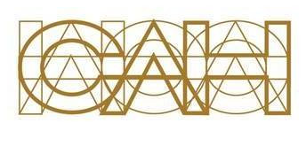
                            <h4>Colegio de Arquitectos de Honduras</h4>
                            

                        

                    

                    

                        

                            
                            <h4>Cámara de Comercio e Industrias de Cortés</h4>
                            

                        

                    

                

                

                    

                        

                            
                            <h4>Institute of Electrical and Electronics Engineers</h4>
                        

                    

                    

                        

                            
                            <h4>Oficina Normativa de Contratación y Adquisiciones del Estado de Honduras</h4>
                        

                    

                    

                        

                            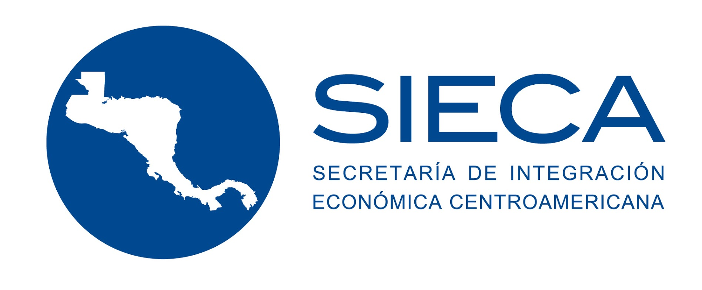
                            <h4>Sistema de Integración Económica para Centroamérica</h4>
                        

                    

                

            

        

        <!--end container-->
    </section>
    <!-- END RESUME -->

    <!-- START SERVICES  -->
    <section id="service" class="section bg-dark">
        

            

                

                    

                        <h3>NUESTROS SERVICIOS</h3>
                        

                    

                

            

            <!--end row-->
            

                <!-- START SINGLE SERVICE DESIGN AREA -->
                

                    

                        

                        <h2 class="text-uppercase">Electricos </h2>
                        
Se proporciona un servicio integral para el desarrollo de
                            iniciativas industriales y de infraestructura. Ingeniería Eléctrica Conceptual, Básica y de
                            detalles.
                            <button type="button" class="btn btn-success" data-toggle="modal" data-target="#electicalModal">
                                Leer mas..
                            </button>
                    

                

                

                    

                        

                        <h2 class="text-uppercase">Mecanicos</h2>
                        
 Estamos comprometidos con el desarrollo sostenible de diversos proyectos de
                            electromecanica, sistemas neumáticos y de vapor, que proporcionen un mejor estándar de vida
                            al usuario.
                            <button type="button" class="btn btn-success" data-toggle="modal" data-target="#mecanicModal">
                                Leer mas..
                            </button>

                    

                

                

                    

                        

                        <h2 class="text-uppercase">Obras civiles</h2>
                        
Nuestros profesionales están capacitados para realizar un trabajo de alto nivel de calidad,
                            realizando obras de un modo eficiente y seguro para nuestro personal y las instalaciones de
                            nuestros clientes.
                            <button type="button" class="btn btn-success" data-toggle="modal" data-target="#builModal">
                                Leer mas..
                            </button>

                    

                

            

            <!--end row-->
        

        <!--end container-->
    </section>
    <!--  END SERVICES -->

    <!-- START Portfolios -->
    <section id="work" class="section">
        

            

                

                    

                        <h2 class="text-center">PORTAFOLIO</h2>
                        

                    

                

            

            <!--end row-->
            

                

                    

                    <ul class="list-unstyled list-inline lrs-list-protfolio" id="filter">
                        <li class="active fil-cat" data-rel="all">Todos</li>
                        <li class="fil-cat" data-rel="electrical">Electricos</li>
                        <li class="fil-cat" data-rel="mecanic">Mecanica</li>
                        <li class="fil-cat" data-rel="build">Obras civiles</li>
                    </ul>
                

                

                    

                        

                            

                                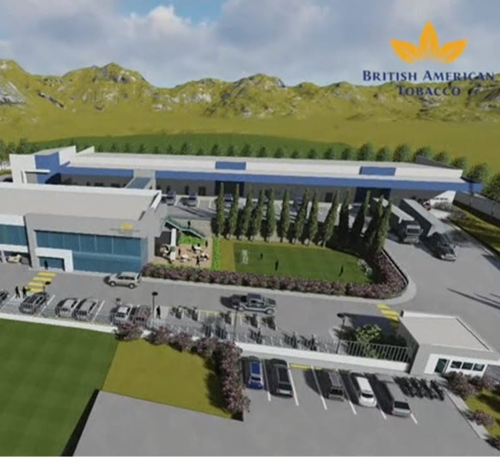
                                

                                    <h6 class="lrs-project-title"> Sistema eléctrico, Obras civiles y Mecanica</h6>
                                    
<b>TABACALERA HONDUREÑA S.A. DE C.V.</b>

                                

                            

                        

                        

                            

                                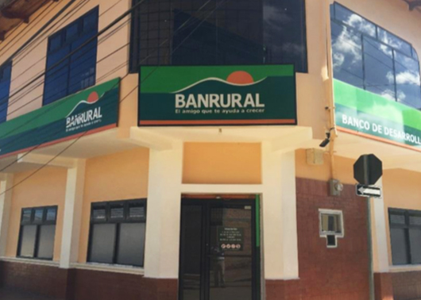
                                

                                    <h6 class="lrs-project-title">Lorem ipsum dolor</h6>
                                    
<b>BANRURAL</b>

                                

                            

                        

                        

                            

                                
                                

                                    <h6 class="lrs-project-title">Lorem ipsum dolor</h6>
                                    
<b>CIGRAH / MERCON</b>

                                

                            

                        

                        

                            

                                
                                

                                    <h6 class="lrs-project-title">Lorem ipsum dolor</h6>
                                    
<b>PLYCEM CONSTRUSISTEMAS HONDURAS</b>

                                

                            

                        

                        

                            

                                
                                

                                    <h6 class="lrs-project-title">Lorem ipsum dolor</h6>
                                    
<b>PETROLEOS AMERICANOS DE HONDURAS</b>

                                

                            

                        

                        

                            

                                
                                

                                    <h6 class="lrs-project-title">Lorem ipsum dolor</h6>
                                    
<b>ITALIAN INDUSTRIAL AGENCY</b>

                                

                            

                        

                        

                            

                                
                                

                                    <h6 class="lrs-project-title">Lorem ipsum dolor</h6>
                                    
<b>CORPORACION DINANT</b>

                                

                            

                        

                        

                            

                                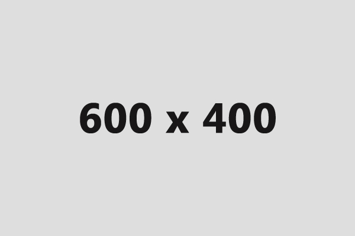
                                

                                    <h6 class="lrs-project-title">Lorem ipsum dolor</h6>
                                    
<b>GMG</b>

                                

                            

                        

                    

                

            

            <!--end row-->
        

        <!--end container-->
    </section>
    <!--  END Portfolios -->

    <!-- START Clients -->
    <section id="Clients" class="section bg-dark">
        

            

                

                    

                        <h2 class="text-uppercase" style="color:white">Referencias</h2>
                        

                    

                

            

            <!--end row-->
            

                

                    

                        

                            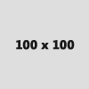
                            
Lorem Ipsum is simply dummy text of the printing and typesetting industry. Lorem Ipsum
                                has been the industry's standard dummy text ever since the 1500s Lorem Ipsum.

                            <h2>mark jukarbarg</h2>
                            <h3>CEO facebook</h3>
                            
                        

                        

                            
                            
Lorem Ipsum is simply dummy text of the printing and typesetting industry. Lorem Ipsum
                                has been the industry's standard dummy text ever since the 1500s Lorem Ipsum.

                            <h2>mark jukarbarg</h2>
                            <h3>CEO facebook</h3>
                            
                        

                        

                            
                            
Lorem Ipsum is simply dummy text of the printing and typesetting industry. Lorem Ipsum
                                has been the industry's standard dummy text ever since the 1500s Lorem Ipsum.

                            <h2>mark jukarbarg</h2>
                            <h3>CEO facebook</h3>
                            
                        

                    

                

            

            <!--end row-->
        

        <!--end container-->
    </section>
    <!--  END Clients -->

    <!-- START blog page -->
    <section id="blog" class="blog-area section">
        

            

                

                    

                        <h2 class="hadding no-margin">Trabajos mas destacados</h2>
                        

                    

                

            

            <!--end row-->
            

                

                    

                        

                            

                                

                                    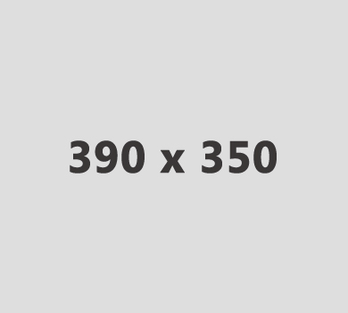
                                

                                

                                

                                    <h2 class="no-margin">Lorem ipsum dolor sit amet...</h2>
                                    

                                        <ul>
                                            <li>26 mars 2016</li>
                                            <li>by admin</li>
                                            <li>comment</li>
                                        </ul>
                                    

                                    
Lorem ipsum dolor sit amet consectetur adipiscing Pellentesque
                                        vestibulum viverra nibh et efficitur. Nullam posuere, metus in suscipit
                                        ultrices

                                    <a class="btn btn-custom btn-sm" href="">Read More</a>
                                

                            

                        

                    

                

                

                    

                        

                            

                                

                                    <h2 class="no-margin">Lorem ipsum dolor sit amet...</h2>
                                    

                                        <ul>
                                            <li>26 mars 2016</li>
                                            <li>by admin</li>
                                            <li>comment</li>
                                        </ul>
                                    

                                    
Lorem ipsum dolor sit amet consectetur adipiscing Pellentesque
                                        vestibulum viverra nibh et efficitur. Nullam posuere, metus in suscipit
                                        ultrices

                                    <a class="btn btn-custom btn-sm" href="">Read More</a>
                                

                                

                                    
                                

                                

                            

                        

                    

                

                

                    

                        

                            

                                

                                    
                                

                                

                                

                                    <h2 class="no-margin">Lorem ipsum dolor sit amet...</h2>
                                    

                                        <ul>
                                            <li>26 mars 2016</li>
                                            <li>by admin</li>
                                            <li>comment</li>
                                        </ul>
                                    

                                    
Lorem ipsum dolor sit amet consectetur adipiscing Pellentesque
                                        vestibulum viverra nibh et efficitur. Nullam posuere, metus in suscipit
                                        ultrices

                                    <a class="btn btn-custom btn-sm" href="">Read More</a>
                                

                            

                        

                    

                

            

            <!--end row-->
        

        <!--end container-->
    </section>
    <!-- END blog page -->

    <!-- START contect -->
    <section id="contact" class="section bg-dark">
        

            

                

                    

                        <h2>contact me</h2>
                        

                    

                

            

            

                

                    <!-- START contect -->
                    

                        <form id="contact-form" method="post">
                            

                                

                                    <input type="text" name="name" class="form-control" id="first-name" placeholder="Name"
                                        required="required">
                                

                                

                                    <input type="email" name="email" class="form-control" id="email" placeholder="Email"
                                        required="required">
                                

                                

                                    <input type="text" name="name" class="form-control" id="contect" placeholder="Phone Contect"
                                        required="required">
                                

                                

                                    <textarea rows="6" name="message" class="form-control" id="description" placeholder="Your Message"
                                        required="required"></textarea>
                                

                                

                                    

                                        <input type="submit" value="Submit now" name="submit" id="submitButton" class="btn btn-custom"
                                            title="Submit Your Message!">
                                    

                                

                            

                        </form>
                    

                

            

            <!--end container-->
        

        <!--end container-->
    </section>
    <!--  END contect-->
    <!-- Modal section -->
    <!-- Modal -->
    

        

            

                

                    <h4 class="modal-title" id="exampleModalLabel">ÁREA ELÉCTRICA</h4>
                    <button type="button" class="close" data-dismiss="modal" aria-label="Close">
                        &times;
                    </button>
                

                

                    

                        

                            

                                
                            

                            

                                
Se proporciona un servicio integral para el desarrollo de iniciativas industriales y
                                    de infraestructura. Ingeniería Eléctrica Conceptual, Básica y de detalles.

                            

                        

                        

                             
                            <ul>
                                <li>1.Diseño, construcción y supervisión. </li>
                                <li>2.Estudios e integración de soluciones para eficiencia y ahorro energético.</li>
                                <li>3.Gestión de proyectos de Energía Renovable.</li>
                                <li>4.Sistemas integrados en media y alta tensión aéreo y subterráneo.</li>
                                <li>5.Sistemas de control y automatización</li>
                                <li>6.Sistemas datos, cámaras de seguridad, accesos integrados y Data Center.</li>
                                <li>7.Sistema de fuerza, subestaciones eléctricas, alimentadores y cuartos
                                    eléctricos, etc.</li>
                                <li>8.Sistemas de iluminación, tomacorrientes, AA.</li>
                            </ul>
                        

                    

                

                

                    <button type="button" class="btn btn-secondary" data-dismiss="modal">Cerrar</button>
                

            

        

    

    <!-- Mecanic section -->
    

        

            

                

                    <h4 class="modal-title" id="exampleModalLabel">ÁREA MECÁNICA</h4>
                    <button type="button" class="close" data-dismiss="modal" aria-label="Close">
                        &times;
                    </button>
                

                

                    

                        

                            

                                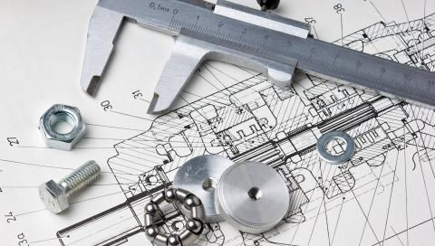
                            

                            

                                
Estamos comprometidos con el desarrollo sostenible de diversos proyectos de
                                    electromecanica, sistemas neumáticos y de vapor, que proporcionen un mejor estándar
                                    de vida al usuario. 

                            

                        

                        

                            <ul>
                                <li>1. Diseño, construcción y supervisión.</li>
                                <li>2. Estudios e integración de soluciones para eficiencia y ahorro energético.</li>
                                <li>3. Sistemas de Heat Ventilation & Air Condition (HVAC).</li>
                                <li>4. Sistemas neumáticos y de vapor. </li>
                                <li>5. Sistemas de agua de procesos, fría o caliente.</li>
                                <li>6. Pintura industrial para maquinarias, tanques y estructuras elevadas.</li>
                            </ul>
                        

                    

                

                

                    <button type="button" class="btn btn-secondary" data-dismiss="modal">Cerrar</button>
                

            

        

    

    <!-- Building Section -->
    

        

            

                

                    <h4 class="modal-title" id="exampleModalLabel">ÁREA DE OBRAS CIVILES</h4>
                    <button type="button" class="close" data-dismiss="modal" aria-label="Close">
                        &times;
                    </button>
                

                

                    

                        

                            

                                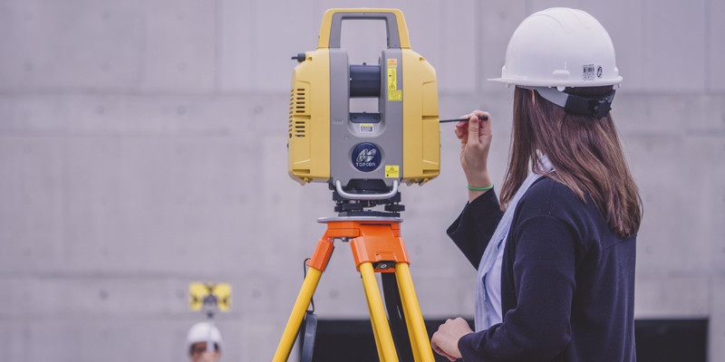
                            

                            

                                
Nuestros profesionales están capacitados para realizar un trabajo de alto nivel de
                                    calidad, realizando obras de un modo eficiente y seguro para nuestro personal y las
                                    instalaciones de nuestros clientes.

                            

                        

                        

                            <ul>
                                <li> 1. Diseño, construcción y supervisión.</li>
                                <li>2. Estructuras metálicas y techos estructurales.</li>
                                <li>3. Construcción de obra gris.</li>
                                <li>4. Terracería</li>
                                <li>5. Sistemas hidro-sanitarios.</li>
                                <li>6. Tabla yeso interior y exterior.</li>
                                <li>7. Pintura arquitectónica e industrial.</li>
                            </ul>
                        

                    

                

                

                    <button type="button" class="btn btn-secondary" data-dismiss="modal">Cerrar</button>
                

            

        

    

    <!-- Ende modal section -->
    <!-- START footer -->
    <footer class="footer-area">
        

            

                

                    

                        <ul>
                            <li><a href=""><i class="fa fa-facebook footer-link"></i></a></li>
                            <li><a href=""><i class="fa fa-instagram footer-link"></i></a></li>
                            <li><a href=""><i class="fa fa-google-plus footer-link"></i></a></li>
                            <li><a href=""><i class="fa fa-whatsapp footer-link"></i></a></li>
                        </ul>
                    

                    
© 2020 Edit Lidia Canales

                

            

        

        

    </footer>
    <!-- END footer-->

    <!-- LATEST JQUERY -->
    
    <!-- BOOTSTRAP JS -->
    
    <!--gallary-->
    
    
    <!-- OWL CAROUSEL JS  -->
    
    <!-- MIXITUP JS -->
    
    <!-- PARALLAX JS -->
    
    <!-- MAGNIFICANT JS -->
    
    
    <!-- EasyPieChart -->
    
    <!-- CONTACT FORM JS -->
    
    <!-- SCRIPT JS -->
    
</body>

</html>